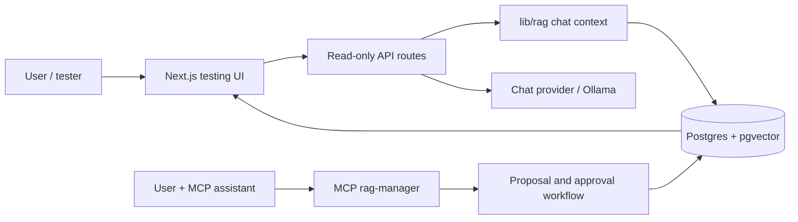

# awesome-rag-forge

<p align="center">
  
</p>

A local-first RAG knowledge-base builder managed through an MCP server, with a read-only testing UI and approval-gated knowledge operations.


## Overview

awesome-rag-forge exists to make a project-specific RAG system editable through natural language without turning the web app into an admin panel. A user connects an MCP-capable assistant, asks it to create or improve the knowledge base, reviews the proposed changes, and only approved knowledge becomes visible to the chat/testing surface.

The business goal is simple: reduce the friction of building a high-quality, reviewable knowledge base while keeping production-facing surfaces small, read-only, and hard to misuse. It is meant for builders who want local-first RAG management, human approval, portable API/client documentation, and a clear separation between “using the knowledge base” and “changing the knowledge base.”

Current status: early local-first project. The MCP server can manage RAG knowledge, harness rules, feedback review, PDF ingestion, and eval creation workflows. The Next.js UI is a testing surface, not a production admin dashboard.

## Key Features

- **MCP-managed knowledge base**: create, review, approve, archive, and inspect RAG knowledge through MCP tools.
- **Read-only testing UI**: chat, collections, harness, and API docs render only when the testing surface and database are ready.
- **Human approval boundary**: knowledge and harness changes go through proposal/review flows before affecting the chat.
- **Feedback loop**: the UI can capture thumbs up/down; review, resolution, and eval creation remain MCP-only.
- **PDF ingestion**: MCP upload tools extract selectable text, fall back to OCR, clean text for LLM use, and optionally store original files in S3-compatible storage.
- **Generated OpenAPI docs**: Swagger/OpenAPI is generated from route annotations and gated behind the same local testing readiness checks.
- **Local Postgres path**: optional Docker Compose setup for Postgres + `pgvector` when the user does not already have a database URL.

## Architecture at a Glance

Think of the project as two connected surfaces sharing one database:

- The **Next.js app** is the showroom: it reads approved knowledge and lets users test what the assistant would answer.
- The **MCP server** is the workshop: it can propose and perform knowledge/harness changes, but only through approval-gated tools.



The important boundary: HTTP routes can read approved state and record narrow answer feedback. MCP tools are the only path for creating, approving, archiving, or resolving operational knowledge workflows.

## Technology Stack

| Layer | Technology |
| --- | --- |
| Web app | Next.js 16, React 19, TypeScript, Tailwind CSS |
| API | Next.js App Router route handlers |
| Knowledge management | MCP server in `mcp/rag-manager` |
| Database | Postgres with `pgvector` |
| ORM | Prisma 7 with `@prisma/adapter-pg` |
| Local model default | Ollama |
| File storage | Optional S3-compatible bucket via AWS SDK |
| PDF/OCR | `pdf-parse`, `tesseract.js` |
| API docs | Swagger JSDoc -> generated OpenAPI JSON -> Swagger UI |
| Tests | Vitest, ESLint, Prisma validation |

## Repository Structure

| Path | Purpose |
| --- | --- |
| `app/` | Next.js pages and API routes for the read-only testing surface. |
| `app/api-docs/` | Gated Swagger UI and generated OpenAPI artifact. |
| `components/` | Shared UI components. |
| `lib/rag/` | Retrieval, chat context, harness validation, and collection read logic. |
| `lib/chat-providers/` | Swappable chat backend interface; Ollama is the implemented default. |
| `mcp/rag-manager/` | MCP tools for knowledge, harness, feedback, file upload, and eval workflows. |
| `prisma/` | Prisma schema and seed data. |
| `docs/` | Official project documentation. |
| `scripts/` | Build/setup helpers, including OpenAPI generation and local Postgres init. |

## Prerequisites

| Requirement | Why |
| --- | --- |
| **Node.js ≥ 20.9** | Runs Next.js and the MCP server (`package.json`'s `engines` field) |
| **PostgreSQL with the `pgvector` extension** | `RagChunk.embedding` is `vector(768)` — schema push fails without it |
| **[Ollama](https://ollama.com)**, running, with a model pulled | Only the chat feature needs this — browsing Collections/Harness and managing knowledge through the MCP server don't |
| **An MCP client** (Claude Desktop, Claude Code, Codex CLI, ...) | The chat app is read-only by design — nothing can be added, approved, or archived without one |

Optional — only if you want uploaded files stored and downloadable:

| Requirement | Why |
| --- | --- |
| An S3-compatible bucket (Cloudflare R2, AWS S3, MinIO, ...) | `STORAGE_BUCKET`/`STORAGE_ACCESS_KEY_ID`/`STORAGE_SECRET_ACCESS_KEY` — see [Environment Variables](docs/environment-variables.md) |

Full detail, including local Docker Postgres, how to enable `pgvector`, and how to connect an MCP client: [docs/development-workflow.md](docs/development-workflow.md#prerequisites).

## Quick start

```bash
git clone <your-fork-or-repo-url>
cd awesome-rag-forge
npm install
cp .env.example .env   # paste DATABASE_URL or use docs/local-postgres.md
npx prisma generate
npx prisma db push
npm run db:seed
npm run dev
```

Open `http://localhost:3000`. If `DATABASE_URL` is missing, the app first shows database setup instructions; if it is present but unreachable, the app shows a database connection error. After the database is configured, the template enables the web testing surface locally with `ENABLE_TESTING_SURFACE=true`; if that flag is missing or false, the app shows instructions for turning it on and blocks the testing API routes. Keep it unset or `false` for Vercel/public deployments unless you intentionally enable it and configure `APP_API_KEY`. Make sure [Ollama](https://ollama.com) is running locally with the model from your `.env` pulled (default `qwen2.5:7b-instruct`).

To let an assistant manage the knowledge base, connect the MCP server — see [docs/mcp-server.md](docs/mcp-server.md).

## LLM provider

The chat's reply-generating backend is swappable, not hardcoded — `app/api/chat/route.ts` only ever talks to a `ChatProvider` interface (`lib/chat-providers/types.ts`), never to a specific model API directly. **Ollama is the default and the only provider implemented today**: it requires no API key, the app auto-detects whether it's running, offers to start it for you locally, and tells you clearly if it's missing rather than failing silently (see `docs/development-workflow.md`).

To point the chat at a different backend later, implement `ChatProvider` for it and register it in `lib/chat-providers/index.ts`; select it with the `CHAT_PROVIDER` env var (defaults to `"ollama"`). Provider credentials (a future `ANTHROPIC_API_KEY`, `OPENAI_API_KEY`, etc.) belong in `.env`, the same as `STORAGE_*` — never entered through the UI or stored in the database. No second provider exists yet; the interface exists so adding one is additive, not a rewrite of the chat route.

## API docs

Every route is described in a generated OpenAPI 3.0 spec — interactive Swagger UI at `/api-docs` when the testing surface is enabled and the database is connected, with a direct download of `openapi.json` on the same page. Feed that file into [openapi-generator](https://openapi-generator.tech) to get a working client in any language — that's the actual "not tied to this project's stack" story: describe the API once, generate a client anywhere. The spec is generated from `@swagger` comments on each route into `app/api-docs/openapi.generated.json` (`scripts/generate-openapi.ts`, run automatically before every build) — see [docs/api-routes.md](docs/api-routes.md#api-docs-and-openapi-spec-api-docs-api-docsopenapijson).

## Status: review dashboard

Today, approving, editing, and archiving knowledge happens through raw MCP tool calls (via whatever MCP client you're using — Claude, Cursor, etc.), not a dedicated screen. A human-friendly review dashboard is planned as a genuinely separate small application — not a write path bolted onto the read-only chat app — connecting to the MCP server's HTTP transport (`npm run mcp:rag-manager:http`, see [docs/mcp-server.md](docs/mcp-server.md#http-transport-for-a-web-based-client-eg-a-future-review-dashboard)) the same way any other MCP client does. The transport exists; the dashboard UI itself doesn't yet.

## Documentation

Full documentation lives in [`docs/`](docs/), organized by topic:

- [Project Overview](docs/overview.md)
- [Operating Modes](docs/operating-modes.md)
- [Repository Structure](docs/repository-structure.md)
- [System Architecture](docs/architecture.md)
- [Database & Prisma](docs/database.md)
- [Local Postgres Setup](docs/local-postgres.md)
- [RAG Architecture](docs/rag.md)
- [Feedback Review Loop](docs/feedback-review-loop.md)
- [MCP Server](docs/mcp-server.md)
- [API Routes](docs/api-routes.md)
- [Testing Surface](docs/testing-surface.md)
- [Environment Variables](docs/environment-variables.md)
- [Development Workflow](docs/development-workflow.md)
- [Testing](docs/testing.md)
- [Deployment](docs/deployment.md)
- [Coding Standards](docs/coding-standards.md)
- [Contributing](docs/contributing.md)
- [Security Considerations](docs/security.md)

If you're working in this repo with an AI coding assistant, start from its entry-point file instead of this README — each one indexes the same `docs/` for AI-assisted sessions, so nothing is documented twice:

| Assistant | Entry file |
| --- | --- |
| Claude Code / Claude Desktop | [CLAUDE.md](CLAUDE.md) |
| OpenAI Codex CLI | [CODEX.md](CODEX.md) |
| Gemini CLI | [GEMINI.md](GEMINI.md) |
| Cursor | [.cursorrules](.cursorrules) |
| Windsurf | [.windsurfrules](.windsurfrules) |
| GitHub Copilot | [.github/copilot-instructions.md](.github/copilot-instructions.md) |
| Cline | [.clinerules](.clinerules) |

All of them are auto-loaded by their respective tool and share the same content: the read-only/MCP-write split, the documentation index, the prerequisites/setup instructions, and the non-negotiable rules. [AGENTS.md](AGENTS.md) holds the one coding note that applies regardless of which assistant is running.

## Example prompts (once your MCP client is connected)

- "Show me my current knowledge base."
- "Add this source to the knowledge base."
- "Search what we know about onboarding."
- "Approve this pending chunk."
- "Fix this fact — it's out of date."
- "Archive this document."
- "Create an eval case."

## License

Add a license before publishing this repository publicly if you intend to open-source it.
