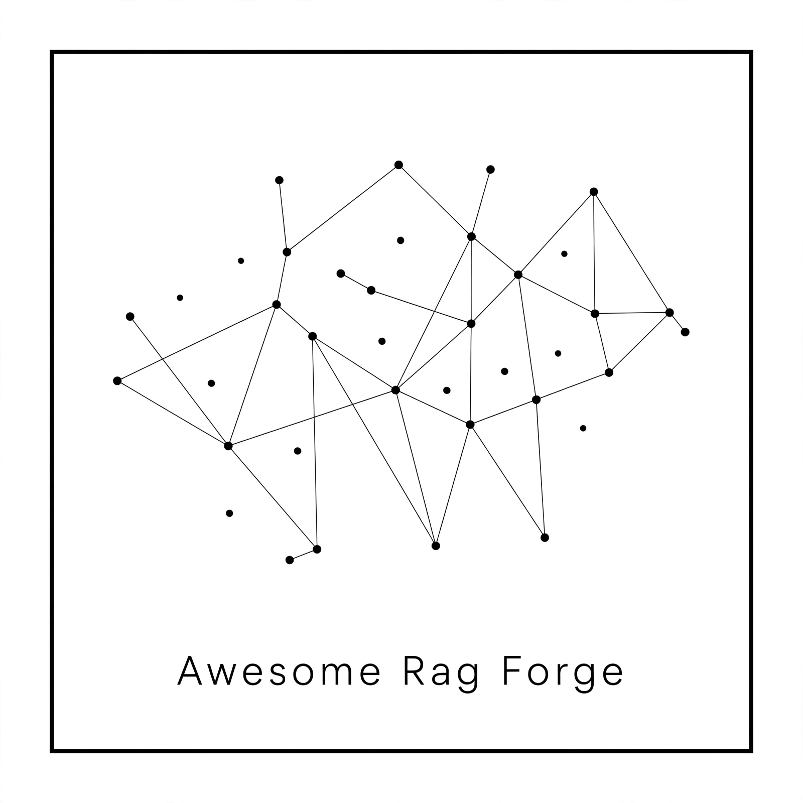
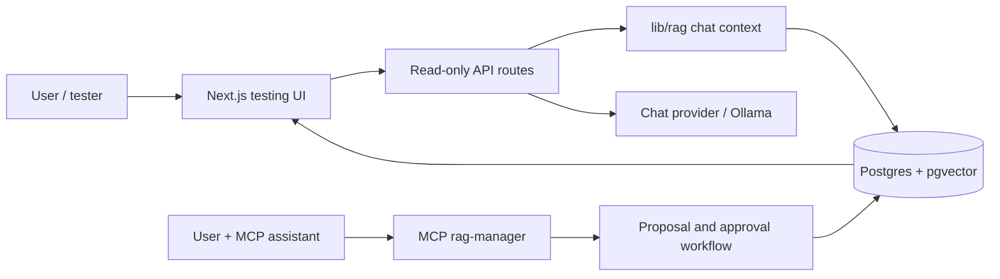

# awesome-rag-forge

<p align="center">
  
</p>

A local-first RAG knowledge-base builder managed through an MCP server, with a read-only testing UI and approval-gated knowledge operations.


## AI Assistant Setup Checklist

If a user drops this repository into an AI coding assistant and asks to set it up, follow this sequence before improvising:

1. Check local prerequisites: `node -v`, `npm -v`, Docker availability if local Postgres may be used, Postgres/`DATABASE_URL`, Ollama, and an MCP-capable client.
2. If `DATABASE_URL` is missing, ask the user one clear question: paste an existing Postgres URL with `pgvector`, or approve creating the included local Docker Postgres database.
3. Ask permission before installing or starting system-level dependencies such as Node.js, Docker Desktop, native Postgres, Ollama, or an MCP client. Do not silently install them.
4. Once the database choice is clear, run the normal setup: `npm install`, copy `.env.example` to `.env`, fill `DATABASE_URL`, `npx prisma generate`, `npx prisma db push`, `npm run db:seed`, then `npm run dev`.
5. If chat is requested and Ollama is missing, stopped, or missing the configured model, explain the issue and ask permission to install/start/pull as needed. The default model is `qwen2.5:7b-instruct` unless `.env` says otherwise.
6. Optional bucket credentials are only needed to preserve original uploaded files for later download. If the user does not have them, continue with text/OCR ingestion; do not block setup.
7. Treat the browser UI as a read-only testing surface, not an MCP client. Opening the browser lets the user test approved knowledge; it does not connect the LLM to MCP tools.
8. To manage knowledge or harness rules, configure an MCP-capable client to run `npm run mcp:rag-manager` with `cwd` pointing at this local clone. Knowledge and harness writes happen through that MCP server only, with user approval for write/destructive actions. For Claude Code, register it directly from the repo root:

   ```bash
   claude mcp add rag-manager -- npm run mcp:rag-manager
   ```

   For other clients (Claude Desktop, Codex CLI), see [MCP Server](docs/mcp-server.md#connecting-to-claude-desktop-or-codex) for the equivalent config.
9. Finish setup with the user-facing handoff in [Post-Install Handoff](docs/post-install-handoff.md).

> **⚠️ After registering the MCP server, restart your session.** Registration does not make the tools available in the conversation that ran the registration command — the `rag-manager` tools only appear in a **new** session of the MCP client. This is the single most common point of confusion: "registered successfully" is not the same as "tools available right now."

## Overview

awesome-rag-forge exists to make a project-specific RAG system editable through natural language without turning the web app into an admin panel. A user connects an MCP-capable assistant, asks it to create or improve the knowledge base, reviews the proposed changes, and only approved knowledge becomes visible to the chat/testing surface.

The business goal is simple: reduce the friction of building a high-quality, reviewable knowledge base while keeping production-facing surfaces small, read-only, and hard to misuse. The system should capture added knowledge, organize it, and prioritize review without silently trusting ambiguous content. It is meant for builders who want local-first RAG management, human approval, portable API/client documentation, and a clear separation between “using the knowledge base” and “changing the knowledge base.”

Current status: early local-first project. The MCP server can manage RAG knowledge, harness rules, feedback review, PDF ingestion, and eval creation workflows. The Next.js UI is a testing surface, not a production admin dashboard.

## Key Features

- **MCP-managed knowledge base**: create, review, approve, archive, and inspect RAG knowledge through MCP tools.
- **Review triage**: new knowledge is saved as `PENDING_REVIEW` with advisory buckets such as `READY_FOR_BATCH_APPROVAL`, `NEEDS_REVIEW`, `CONFLICTS_WITH_APPROVED`, and `DUPLICATE_OR_UPDATE_CANDIDATE`; none of those buckets bypass human approval.
- **Read-only testing UI**: chat, collections, harness, and API docs render only when the testing surface and database are ready.
- **Human approval boundary**: knowledge and harness changes go through proposal/review flows before affecting the chat.
- **Audience and visibility controls**: collections and documents carry an audience (`EXTERNAL`, `INTERNAL`, `RESTRICTED`) and use-context visibility (`CHAT`, `OPERATOR`, `REVIEW`, `EVAL`); the chat and read-only UI only see approved external knowledge marked `CHAT`.
- **Feedback loop**: the UI can capture thumbs up/down; review, resolution, and eval creation remain MCP-only.
- **PDF ingestion**: MCP upload tools extract selectable text, fall back to OCR, clean text for LLM use, and optionally store original files in S3-compatible storage.
- **Generated OpenAPI docs**: Swagger/OpenAPI is generated from route annotations and gated behind the same local testing readiness checks.
- **Local Postgres path**: optional Docker Compose setup for Postgres + `pgvector` when the user does not already have a database URL.

## Architecture at a Glance

Think of the project as two connected surfaces sharing one database:

- The **Next.js app** is the showroom: it reads approved knowledge and lets users test what the assistant would answer.
- The **MCP server** is the workshop: it can propose and perform knowledge/harness changes, but only through approval-gated tools.



The important boundary: HTTP routes can read approved state and record narrow answer feedback. MCP tools are the only path for creating, approving, archiving, or resolving operational knowledge workflows.

Visibility labels describe use contexts (`CHAT`, `OPERATOR`, `REVIEW`, `EVAL`), not whether the MCP server can physically see a row. MCP tool access is governed by the tool's purpose, operating mode, and approval rules. If a user asks to add knowledge but does not say what kind it is, the assistant must ask them to choose `EXTERNAL`, `INTERNAL`, or `RESTRICTED` before saving.

## Technology Stack

| Layer | Technology |
| --- | --- |
| Web app | Next.js 16, React 19, TypeScript, Tailwind CSS |
| API | Next.js App Router route handlers |
| Knowledge management | MCP server in `mcp/rag-manager` |
| Database | Postgres with `pgvector` |
| ORM | Prisma 7 with `@prisma/adapter-pg` |
| Local model default | Ollama |
| File storage | Optional S3-compatible bucket via AWS SDK |
| PDF/OCR | `pdf-parse`, `tesseract.js` |
| API docs | Swagger JSDoc -> generated OpenAPI JSON -> Swagger UI |
| Tests | Vitest, ESLint, Prisma validation |

## Repository Structure

| Path | Purpose |
| --- | --- |
| `app/` | Next.js pages and API routes for the read-only testing surface. |
| `app/api-docs/` | Gated Swagger UI and generated OpenAPI artifact. |
| `components/` | Shared UI components. |
| `lib/rag/` | Retrieval, chat context, harness validation, and collection read logic. |
| `lib/chat-providers/` | Swappable chat backend interface; Ollama is the implemented default. |
| `mcp/rag-manager/` | MCP tools for knowledge, harness, feedback, file upload, and eval workflows. |
| `prisma/` | Prisma schema and seed data. |
| `docs/` | Official project documentation. |
| `scripts/` | Build/setup helpers, including OpenAPI generation and local Postgres init. |

## Prerequisites

| Requirement | Why |
| --- | --- |
| **Node.js ≥ 20.9** | Runs Next.js and the MCP server (`package.json`'s `engines` field) |
| **PostgreSQL with the `pgvector` extension** | `RagChunk.embedding` is `vector(768)` — schema push fails without it |
| **[Ollama](https://ollama.com)**, running, with a model pulled | Only the chat feature needs this — browsing Collections/Harness and managing knowledge through the MCP server don't |
| **An MCP client** (Claude Desktop, Claude Code, Codex CLI, ...) | The chat app is read-only by design — nothing can be added, approved, or archived without one |

Optional — only if you want uploaded files stored and downloadable:

| Requirement | Why |
| --- | --- |
| An S3-compatible bucket (Cloudflare R2, AWS S3, MinIO, ...) | `STORAGE_BUCKET`/`STORAGE_ACCESS_KEY_ID`/`STORAGE_SECRET_ACCESS_KEY` — see [Environment Variables](docs/environment-variables.md) |

Full detail, including local Docker Postgres, how to enable `pgvector`, and how to connect an MCP client: [docs/development-workflow.md](docs/development-workflow.md#prerequisites).

## Quick start

```bash
git clone <your-fork-or-repo-url>
cd awesome-rag-forge
npm install
cp .env.example .env   # paste DATABASE_URL or use docs/local-postgres.md
npx prisma generate
npx prisma db push
npm run db:seed
npm run dev
```

Open `http://localhost:3000`. If `DATABASE_URL` is missing, the app first shows database setup instructions; if it is present but unreachable, the app shows a database connection error. After the database is configured, the template enables the web testing surface locally with `ENABLE_TESTING_SURFACE=true`; if that flag is missing or false, the app shows instructions for turning it on and blocks the testing API routes. Keep it unset or `false` for Vercel/public deployments unless you intentionally enable it and configure `APP_API_KEY`. After the database is ready, the testing UI asks which chat provider to use. Ollama is the offline default and the UI can try to install/start it locally where supported; Claude, Codex/OpenAI, and Gemini show a copyable setup prompt until their API key is added to `.env` and the dev server is restarted.

Opening the browser is enough to test the approved RAG, but it is not enough to manage knowledge. The browser UI is not an MCP client and should remain read-only. To let an assistant create, organize, approve, archive, or otherwise manage knowledge/harness rules, connect an MCP-capable client to the MCP server — see [docs/mcp-server.md](docs/mcp-server.md).

## LLM provider

The chat's reply-generating backend is swappable, not hardcoded — `app/api/chat/route.ts` only ever talks to a `ChatProvider` interface (`lib/chat-providers/types.ts`), never to a specific model API directly. Ollama is the offline default; Claude, Codex/OpenAI, and Gemini are available for hosted testing when their API keys are present in `.env`.

The testing UI shows a provider chooser, caches the selected provider in the browser, and goes straight back to chat on reload once that provider is configured. If a hosted provider is missing its key, the UI shows a copyable setup prompt for the user's coding assistant instead of asking for secrets in the browser. Ollama remains local-first: the UI can attempt to install/start it on the same machine when local-only guards allow it, then pull one of the small allowlisted test models.

The HTTP surface is intentionally split: chat/context/collections/document-download/harness routes are read-only testing and integration surfaces over approved data, while `/api/ollama/*` and `/api/chat/providers` are local setup/support routes. Knowledge and harness management still never happen over these routes; they remain MCP-only.

## API docs

Every route is described in a generated OpenAPI 3.0 spec — interactive Swagger UI at `/api-docs` when the testing surface is enabled and the database is connected, with a direct download of `openapi.json` on the same page. Feed that file into [openapi-generator](https://openapi-generator.tech) to get a working client in any language — that's the actual "not tied to this project's stack" story: describe the API once, generate a client anywhere. The spec is generated from `@swagger` comments on each route into `app/api-docs/openapi.generated.json` (`scripts/generate-openapi.ts`, run automatically before every build) — see [docs/api-routes.md](docs/api-routes.md#api-docs-and-openapi-spec-api-docs-api-docsopenapijson).

## Review dashboard

The local testing UI includes `/review`, a human-friendly review queue for pending chunks and harness rules. This page is deliberately local-only: it reads pending rows directly from the configured Postgres database and uses server actions for approve/reject decisions, guarded by `ENABLE_TESTING_SURFACE=true` and a non-production runtime check (`lib/local-review-guard.ts`). It is not an MCP client, does not require `MCP_AUTH_TOKEN`, and must not be exposed as a hosted admin panel. The normal chat, collections, harness, and API surfaces remain approved-data/read-only.

## Public site

Everything above is local-only by design. If you want a public URL for this project, it's [`public-site/index.html`](public-site/index.html) — a single static HTML file with no framework, no build step, and no server code. It fetches and renders this repo's `README.md` live from GitHub, so editing docs and pushing updates the live page with no redeploy.

This repository includes [`vercel.json`](vercel.json) to make Vercel deploy only `public-site/`: the framework preset is `Other`, install/build commands are empty, and the output directory is `public-site`. Production must never run `next build`; the full Next.js app, API routes, MCP server, review UI, database workflows, and provider setup flows are local-only. See [Deployment](docs/deployment.md#the-only-thing-meant-to-be-deployed-publicly-public-site) for why this is the only thing meant to be deployed, and how it makes that guarantee structurally rather than by convention.

## Documentation

Full documentation lives in [`docs/`](docs/), organized by topic:

- [Project Overview](docs/overview.md)
- [Operating Modes](docs/operating-modes.md)
- [Repository Structure](docs/repository-structure.md)
- [System Architecture](docs/architecture.md)
- [Database & Prisma](docs/database.md)
- [Local Postgres Setup](docs/local-postgres.md)
- [RAG Architecture](docs/rag.md)
- [Feedback Review Loop](docs/feedback-review-loop.md)
- [Post-Install Handoff](docs/post-install-handoff.md)
- [MCP Server](docs/mcp-server.md)
- [API Routes](docs/api-routes.md)
- [Testing Surface](docs/testing-surface.md)
- [Environment Variables](docs/environment-variables.md)
- [Development Workflow](docs/development-workflow.md)
- [Testing](docs/testing.md)
- [Deployment](docs/deployment.md)
- [Coding Standards](docs/coding-standards.md)
- [Contributing](docs/contributing.md)
- [Security Considerations](docs/security.md)
- [License](docs/license.md)

If you're working in this repo with an AI coding assistant, start from its entry-point file instead of this README — each one indexes the same `docs/` for AI-assisted sessions, so nothing is documented twice:

| Assistant | Entry file |
| --- | --- |
| Claude Code / Claude Desktop | [CLAUDE.md](CLAUDE.md) |
| OpenAI Codex CLI | [CODEX.md](CODEX.md) |
| Gemini CLI | [GEMINI.md](GEMINI.md) |
| Cursor | [.cursorrules](.cursorrules) |
| Windsurf | [.windsurfrules](.windsurfrules) |
| GitHub Copilot | [.github/copilot-instructions.md](.github/copilot-instructions.md) |
| Cline | [.clinerules](.clinerules) |

All of them are auto-loaded by their respective tool and share the same content: the read-only/MCP-write split, the documentation index, the prerequisites/setup instructions, and the non-negotiable rules. [AGENTS.md](AGENTS.md) holds the one coding note that applies regardless of which assistant is running.

## Example prompts (once your MCP client is connected)

- "Show me my current knowledge base."
- "Add this source to the knowledge base."
- "Search what we know about onboarding."
- "Approve this pending chunk."
- "Fix this fact — it's out of date."
- "Archive this document."
- "Create an eval case."

## License

This project is licensed under the MIT License. See [LICENSE](LICENSE) for the full text.
